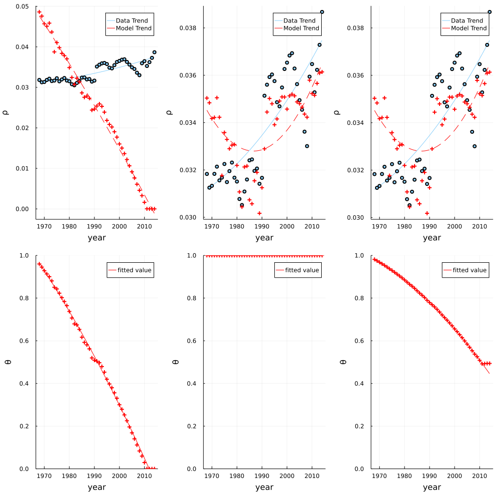
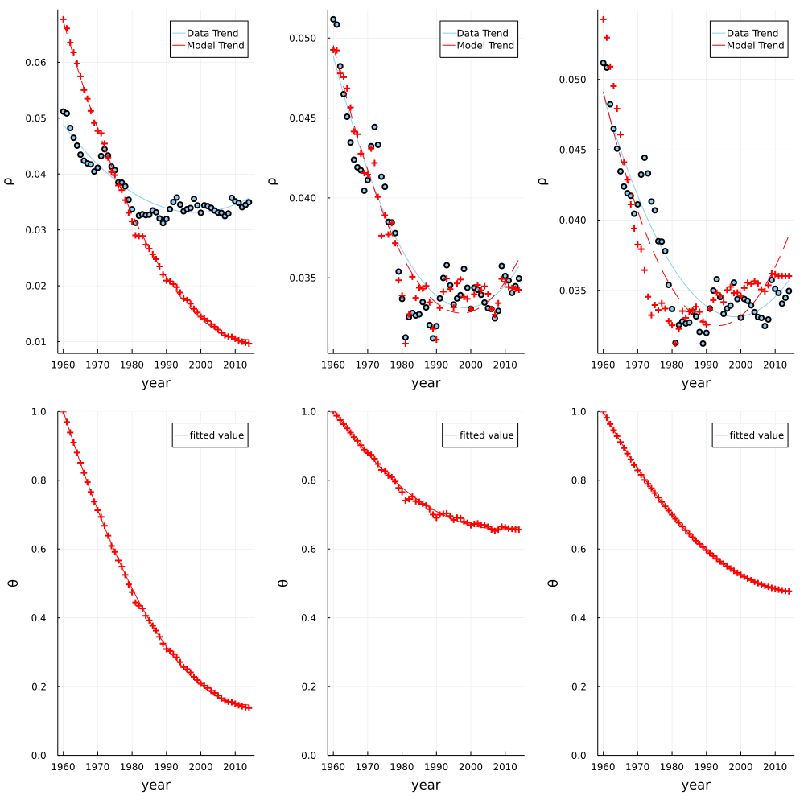
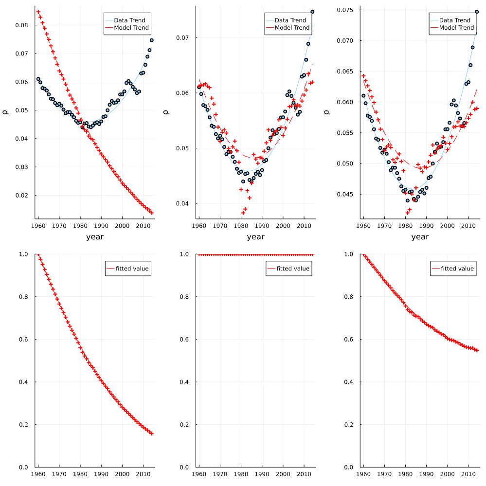
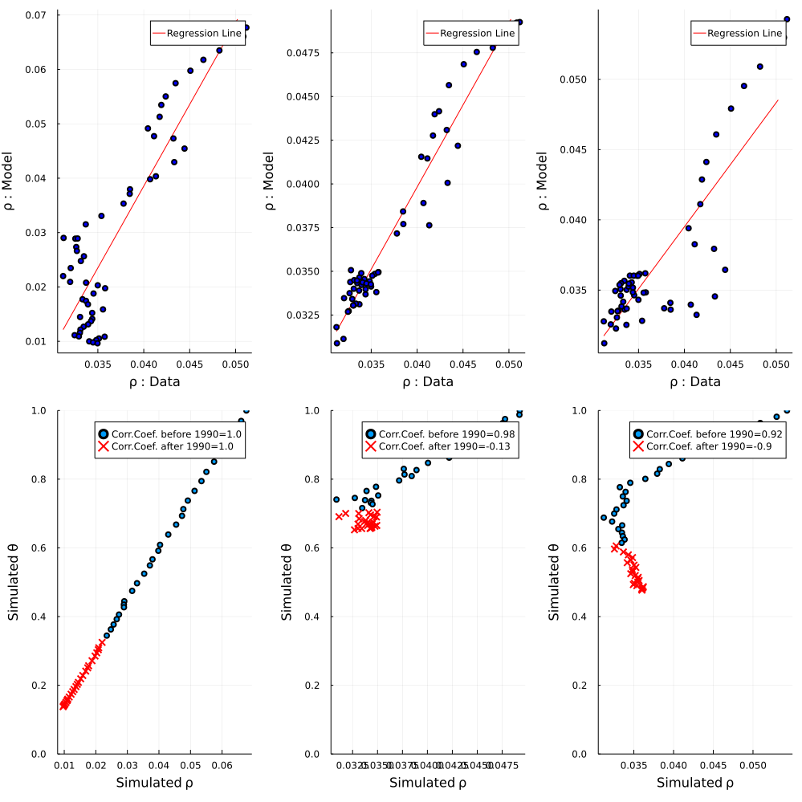
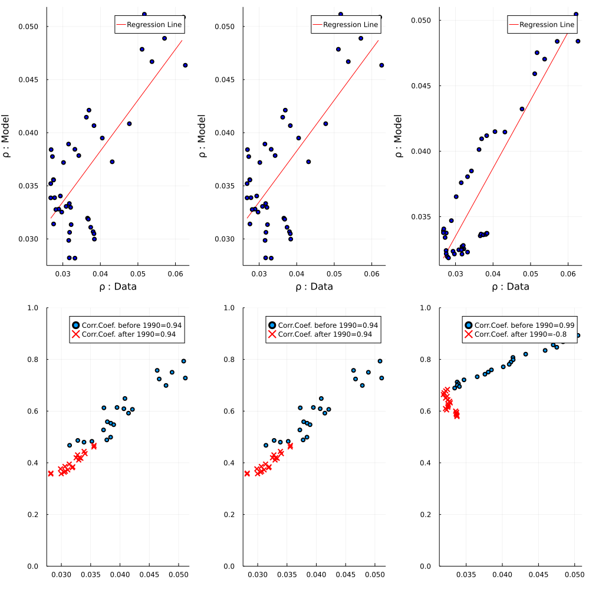
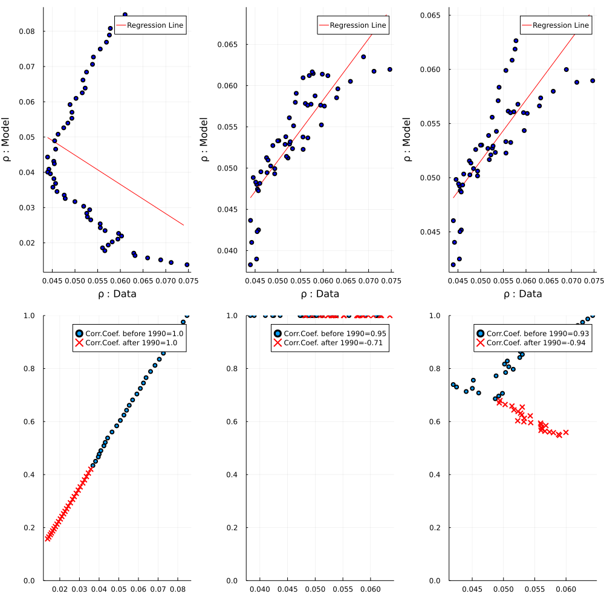
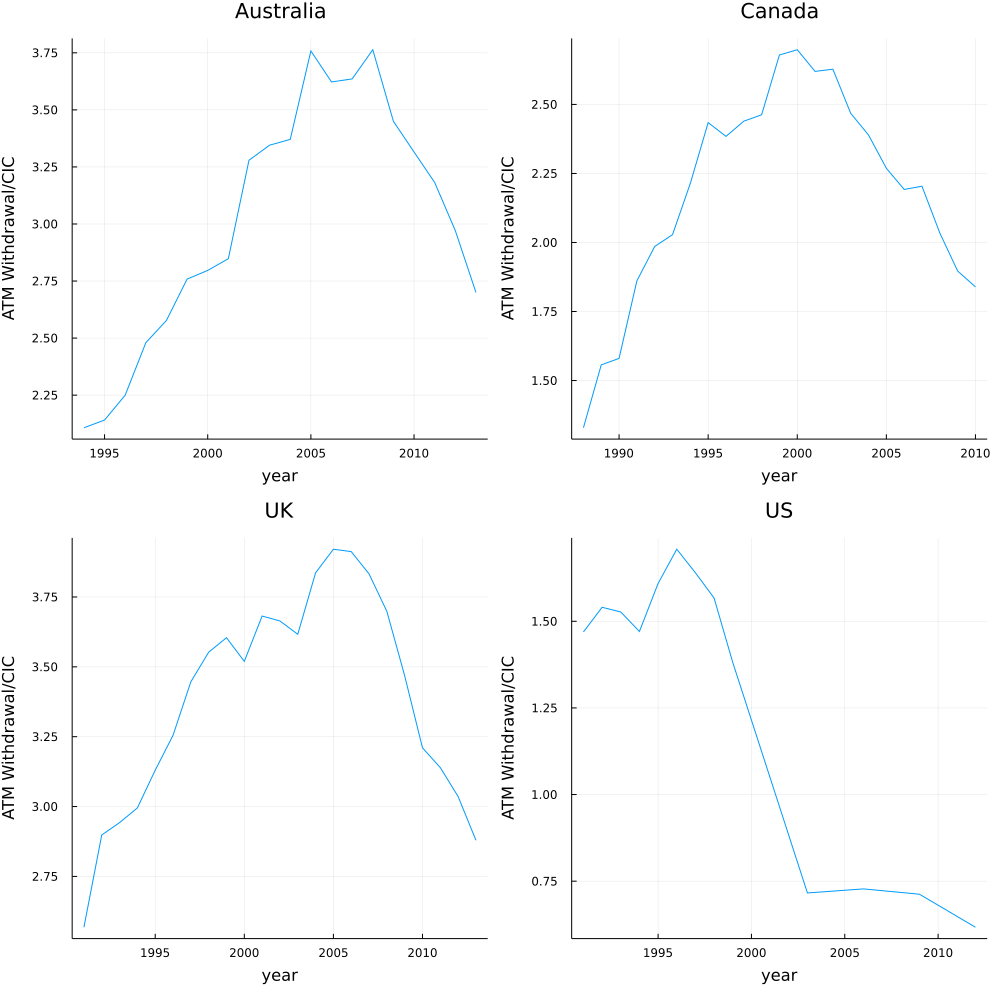

# Our Replication of The Cash Paradox (Jiang & Shao, 2019)

> This replication study was part of our evaluation for the course [Numerical Methods](https://floswald.github.io/NumericalMethods/) at SciencesPo Paris in Spring 2021

In this replication study, we do ...

```@autodocs
Modules = [CashParadox]
```

**Replication of model predictions: Figures 5a-5d**

**Figure 5a: AUSTRALIA**


**Figure 5b: CANADA**


**Figure 5c:  UK**


**Figure 5d: US**



**Replication of model predictions: Figures A2a-A2d**

**Figure A2a: AUSTRALIA**


**Figure A2b: CANADA**


**Figure A2c:  UK**


**Figure A2d: US**



**Replication of regime changes over time: Figure A3**


**Replication of The Value of ATM withdrawals over CIC: Figure A4**



**Replication of Cash receipts from circulation in the Federal Reserve Banks: Figure A5**


**Replication of Different measures of nominal interest rates: Figure D1**


**Replication of CIC/GDP with different interest rate specifications: Figure D2**


**Replication of Table G.1: Calibration results: unregistered activities**
![figG1
end
